# CS682: Quantum Algorithms - Comprehensive Lecture Notes

## Course Overview

**Course Title:** CS682 - Quantum Algorithms  
**Focus:** This is a course on quantum algorithms, NOT quantum computing hardware  
**Perspective:** Computer science approach to quantum computation

### Prerequisites

**Required:**
- **Linear Algebra** (Essential)
  - Eigenvalues and eigenvectors
  - Matrices and matrix operations
  - Vector spaces
  - Inner products and norms

**Recommended:**
- **Probability Theory**
- Strong motivation to learn (motivation typically decreases as semester progresses)

---

## Fundamental Questions

### 1. What is Quantum Computing?

#### Student Responses Analysis

| Response | Evaluation | Commentary |
|----------|------------|-----------|
| "Uses laws of quantum mechanics for computing" | ✓ Correct | Most accurate high-level answer |
| "Classical uses bits, quantum uses qubits" | ✓ Technically correct | "Manager's answer" - correct but not insightful |
| "Simulates quantum mechanics" | ~ Partial | This is a use case, not a definition |
| "Parallel computing" | ✗ Wrong | Common misconception |
| "Randomized computing" | ✗ Wrong | Common misconception |

#### Critical Distinctions

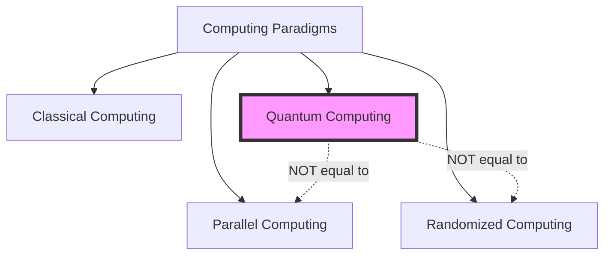

**Important:** Quantum computing is **fundamentally different** from:
- **Parallel computing** (existed before quantum computing)
- **Randomized computing** (existed before quantum computing)

---

## Understanding Computation

### What is Computation?

**Definition:** Computation is performing tasks in an **automated way** using a device that follows **predictable physical laws**.

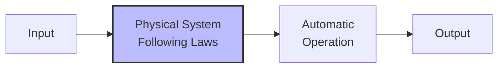

**Key Components:**
1. **Input:** Initial state/data
2. **Operation:** Governed by physical laws
3. **Output:** Result that can be measured/extracted

**Essential Point:** Computation doesn't require complexity - even "2 + 2 = 4" computed automatically is computation.

---

## Examples of Physical Computers

### Example 1: The Billiard Computer

**System:** A robot that pockets billiard balls exactly 50% of the time

**Physical Law:** Probabilistic pocketing (50% success rate)

**Computation:** Division by 2

**How it works:**
1. Place $n$ balls on the table
2. Robot hits all balls
3. Count pocketed balls ≈ $\frac{n}{2}$

**Mathematical representation:**
$$\text{Output} = \frac{\text{Input balls}}{2}$$

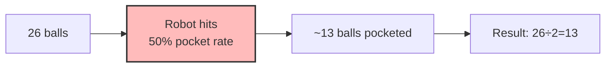

**Components:**
- **Input:** Placing $n$ balls
- **Physical law:** 50% pocketing probability
- **Operation:** Robot hitting
- **Output:** Counting pocketed balls

---

### Example 2: The ROW Insect Computer

**System:** Imaginary insect with rings determined by genetics

**Physical Law (Dominant Gene):**
- If at least one parent has ring → offspring has ring
- Rings controlled by dominant gene

**Computation:** OR gate

**Truth Table:**

| Parent A | Parent B | Offspring |
|----------|----------|-----------|
| No ring (0) | No ring (0) | No ring (0) |
| No ring (0) | Ring (1) | Ring (1) |
| Ring (1) | No ring (0) | Ring (1) |
| Ring (1) | Ring (1) | Ring (1) |

**Logical representation:**
$$\text{Offspring} = \text{Parent}_A \lor \text{Parent}_B$$

#### Additional Operation: Gene Therapy (NOT gate)

**Injection effect:** Reverses ring status
- Ring → No ring
- No ring → Ring

$$\text{After injection} = \neg(\text{Before injection})$$

#### Universal Computation with ROW Insects

With OR and NOT gates, we can create a **universal computer**:

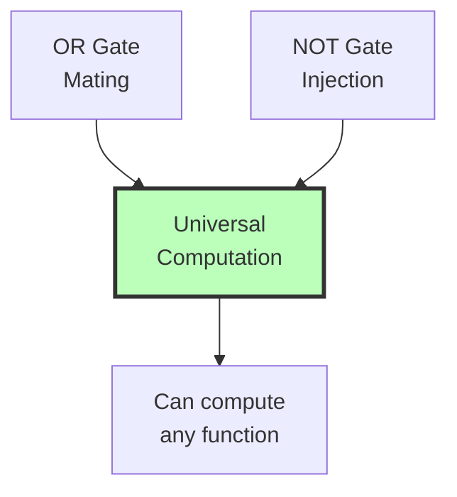

**Why universal?**
- OR + NOT → Can create AND gate
- AND + OR + NOT → Functionally complete set
- Can implement any Boolean function

**AND gate from OR and NOT:**
$$A \land B = \neg(\neg A \lor \neg B)$$

---

### Example Circuit: Complex ROW Computation

**Circuit Description:**
1. Start with two insects without rings (A=0, B=0)
2. If $a=1$: inject insect A (makes it have ring)
3. If $b=1$: inject insect B (makes it have ring)
4. Mate the two insects
5. Inject the offspring

**Step-by-step analysis:**

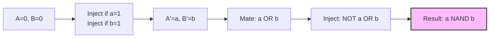

**Mathematical transformation:**

$$\text{After injections: } A' = a, \quad B' = b$$

$$\text{After mating: } \text{Offspring} = a \lor b$$

$$\text{After final injection: } \text{Result} = \neg(a \lor b) = \neg a \land \neg b$$

This computes: **NOT(A OR B) = (NOT A) AND (NOT B)** (De Morgan's Law)

---

## Key Principle: Encoding Computation in Physical Laws

**Central Concept:**

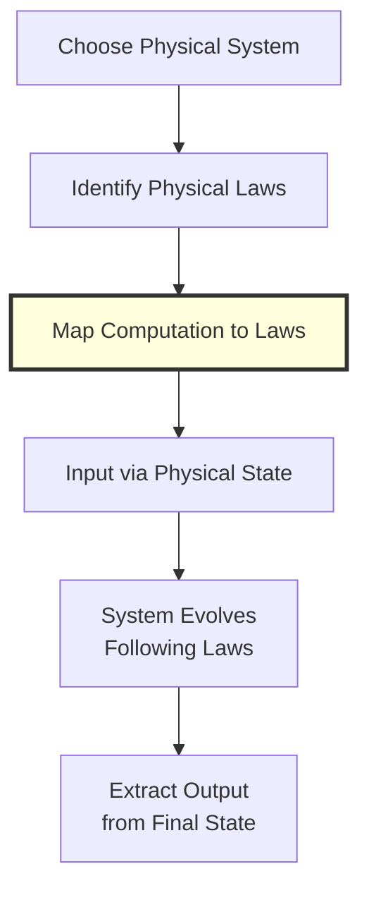

**Examples:**
- **Electricity:** Kirchhoff's law, Ohm's law → AND, OR, NOT gates
- **Billiards:** Probabilistic pocketing → Division
- **Biology:** Genetic inheritance → Logic gates
- **Quantum mechanics:** Superposition, entanglement → Quantum algorithms

---

## Defining Quantum Computing

### Formal Definition

**Quantum Computing:**  
Encoding our computation using laws of quantum mechanics, such that the computation is performed by a quantum device following these laws.

$$\text{Quantum Computer} = \text{Quantum System} + \text{Automated Task}$$

Where:
- **Quantum System:** Physical device obeying quantum mechanical laws
- **Automated Task:** Computation performed without human intervention

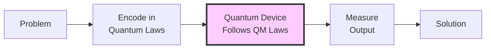

---

## Critical Question: Why Quantum Computing?

### The Paradox

**Problem:** Everything (theoretically) follows quantum mechanical laws!

> "Quantum mechanics is the theory of (almost) everything"

**Then why isn't everything a quantum computer?**

---

### Answer: Coherence and Observable Quantum Effects

#### When Quantum Effects Are Observable

Quantum mechanical effects that differ from classical behavior (superposition, entanglement) are only **observable** when:

1. **System is very small** (microscopic scale)
2. **System is very cold** (low thermal noise)
3. **System is isolated** (minimal environmental interaction)

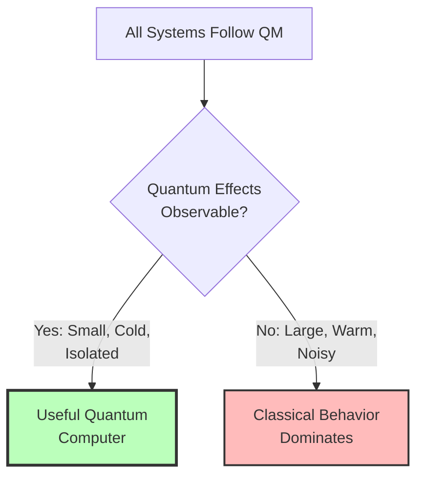

#### Why Newton Discovered Classical Mechanics

At macroscopic scales (apples falling from trees):
- Quantum effects average out
- Classical laws emerge
- Deterministic, predictable behavior

**Scale Comparison:**

| Scale | Behavior | Example |
|-------|----------|---------|
| Macroscopic | Classical | Falling apple, planets |
| Microscopic | Quantum | Electrons, photons, atoms |
| Mesoscopic | Transition | Some quantum, some classical |

---

### The Engineering Challenge

**Why Quantum Computers Are Hard to Build:**

1. Must control **very small** systems (atoms, electrons, photons)
2. Must keep systems **very cold** (near absolute zero)
3. Must **isolate** from environment (prevent decoherence)
4. Must maintain **quantum coherence** long enough to compute

**Coherence Time:** The duration quantum properties persist before environmental noise destroys them

$$T_{\text{coherence}} \gg T_{\text{computation}}$$

This inequality must hold for useful quantum computation.

---

## Why Hope for Quantum Advantage?

### Reason 1: Theory of (Almost) Everything

Quantum mechanics governs fundamental physics → Most powerful theoretical framework

### Reason 2: Weird Properties

**Superposition:** System can be in multiple states simultaneously

$$|\psi\rangle = \alpha|0\rangle + \beta|1\rangle$$

where $|\alpha|^2 + |\beta|^2 = 1$

**Entanglement:** Correlations between particles stronger than classical

For two qubits:
$$|\Phi^+\rangle = \frac{1}{\sqrt{2}}(|00\rangle + |11\rangle)$$

Cannot be written as product of individual qubit states!

```mermaid
graph LR
    A[Classical Bit] --> B[State: 0 OR 1]
    C[Quantum Bit] --> D[State: α|0⟩ + β|1⟩]
    D --> E[Superposition of<br/>0 AND 1]
    
    style C fill:#fcf,stroke:#333,stroke-width:2px
    style E fill:#cff,stroke:#333,stroke-width:2px
```

---

### Historical Timeline

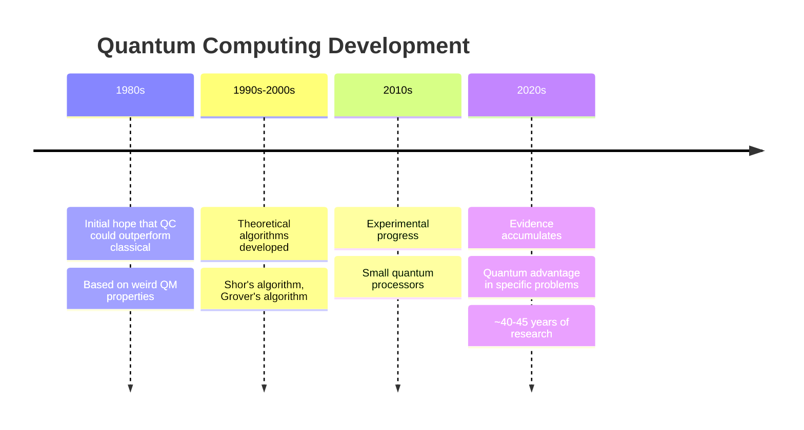

**Current Status (as of 2025):**  
We have **substantial evidence** that quantum computers can solve certain problems better than classical computers.

---

## Summary: The "Better" Question

### What Does "Better" Mean?

This crucial question will be addressed in subsequent lectures, but preliminary understanding:

**Potential Quantum Advantages:**
1. **Exponential speedup** for specific problems
2. **Polynomial speedup** for search problems  
3. **Simulation** of quantum systems
4. **Optimization** in high-dimensional spaces

**Not advantages:**
- General parallel processing (we have classical parallel computers)
- Random number generation (we have classical randomness)
- All problems (quantum computers have limitations too)

---

## Key Takeaways

### Critical Points to Remember

1. **QC ≠ Parallel Computer**
   - Fundamentally different computational model
   - Different source of power

2. **QC ≠ Randomized Computer**
   - Quantum is deterministic (unitary evolution)
   - Measurement introduces probabilistic outcomes, but evolution is not random

3. **Computation = Encoding in Physical Laws**
   - Any predictable physical system can compute
   - Different laws enable different computations

4. **Quantum Effects Require Special Conditions**
   - Small scale
   - Low temperature
   - Isolation from environment

5. **Hope Based on Theory + Weirdness**
   - QM is fundamental theory
   - Superposition and entanglement enable new computational paradigms

### Looking Forward

The course will explore:
- How to encode problems in quantum systems
- Specific quantum algorithms that achieve advantages
- Mathematical framework for quantum computation
- Limitations and challenges

---

## Conceptual Framework Summary

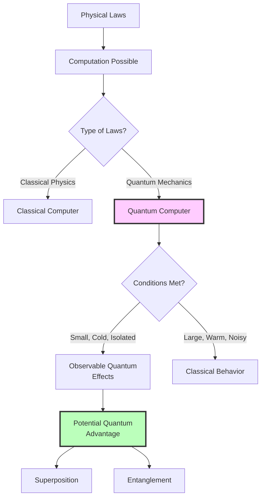

---

## Mathematical Notation Introduced

### Classical vs Quantum States

**Classical bit:**
$$b \in \{0, 1\}$$

**Quantum bit (qubit):**
$$|\psi\rangle = \alpha|0\rangle + \beta|1\rangle$$

where $\alpha, \beta \in \mathbb{C}$ and $|\alpha|^2 + |\beta|^2 = 1$

### Boolean Operations

**OR operation:**
$$A \lor B = 1 \text{ if } A=1 \text{ or } B=1$$

**AND operation:**
$$A \land B = 1 \text{ if } A=1 \text{ and } B=1$$

**NOT operation:**
$$\neg A = 1 \text{ if } A=0$$

**De Morgan's Law (used in ROW circuit):**
$$\neg(A \lor B) = \neg A \land \neg B$$


# CS682: Quantum Algorithms - Lecture Notes (Continued)

## Defining "Better": What Can Quantum Computers Do?

### The Church-Turing Hypothesis

**Question:** What can a classical computer do?

**Answer:** Everything computable by a **Turing Machine**

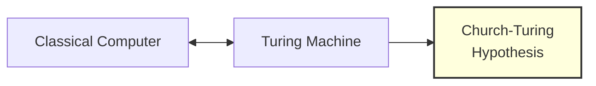

**Church-Turing Hypothesis:**
> Whatever computation you can do, can be done by a Turing machine.

**Mathematical Statement:**
$$\text{Computable} \equiv \text{Turing Machine Computable}$$

This establishes the **equivalence** between:
- Classical computers (with sufficient memory)
- Turing machines
- Any model of classical computation

---

## Can Quantum Computers Break Church-Turing?

### Weak Church-Turing Hypothesis

**First Hope:** Quantum computers can compute what classical computers cannot

$$\text{QC can compute what CC can't}$$

Where:
- **QC** = Quantum Computer
- **CC** = Classical Computer

**Reality Check: NO** ❌

**Why?**
- Classical computers can **simulate** quantum computers
- Any quantum computation can be done classically (given enough time)
- Quantum computers can **simulate** classical computers efficiently

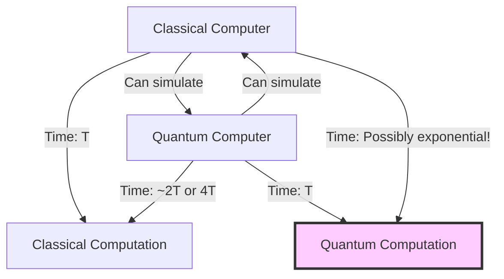

**Key Asymmetry:**

| Direction | Efficiency |
|-----------|------------|
| Classical → Quantum simulation | **Efficient** (polynomial overhead) |
| Quantum → Classical simulation | **Inefficient** (possibly exponential) |

**Classical simulating Quantum:**
- If quantum takes time $T$ → classical takes $\gg T$
- No known bound like $T^2$, $T^4$, or even $T^{100}$
- Could be $2^T$ or worse!

**Quantum simulating Classical:**
- If classical takes time $T$ → quantum takes $\sim 2T$ or $4T$
- Polynomial overhead (efficient)

---

## The Real Advantage: Resource Efficiency

### What "Better" Actually Means

**Better = More Resource Efficient**

Primarily measured in **time complexity**, but could include:
- Time (most important)
- Space (memory)
- Energy
- Other resources

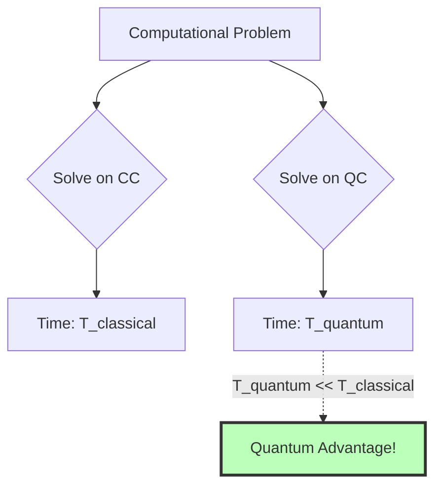

**Mathematical Expression:**

For a problem of size $n$:
- Classical: $T_{\text{classical}}(n) = f(n)$
- Quantum: $T_{\text{quantum}}(n) = g(n)$

**Quantum advantage when:** $g(n) \ll f(n)$

Examples:
- $f(n) = 2^n$ (exponential) vs $g(n) = n^3$ (polynomial)
- $f(n) = n^2$ vs $g(n) = \sqrt{n}$

---

## Strong Church-Turing Hypothesis

**Statement:**
> Whatever you can compute, you can compute on a Turing machine **efficiently**.

**Formal Definition:**

If a physical device can solve a problem in time $T$, then a Turing machine can solve it in time related to $T$ by at most a polynomial factor.

$$T_{\text{device}} = T \implies T_{\text{Turing}} = O(T^k) \text{ for some constant } k$$

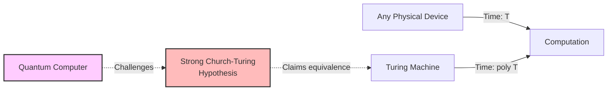

### What Quantum Computers Challenge

**Hope:** Quantum computers can **break** the Strong Church-Turing Hypothesis

**Meaning:**
- Some computations done in time $T$ on QC
- Require time $\gg \text{poly}(T)$ on classical Turing machine
- Possibly exponential separation: $2^T$ on classical vs $T$ on quantum

**Clarification on Classical vs Quantum:**
- QC can simulate CC with **constant factor** overhead
- Anything on CC in time $T$ → QC in time $2T$ or $4T$ (polynomial)
- The separation exists in the **other direction**
- QC computation in time $T$ → CC might need exponential time

---

## Brief History of Quantum Computing

### Timeline and Breakthroughs

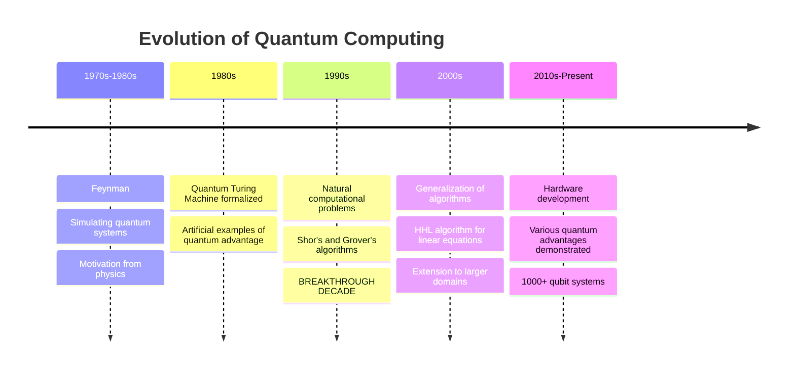

---

### 1970s-1980s: Feynman's Motivation

**Richard Feynman's Insight:**

**Goal:** Simulating quantum systems

**Problem Setup:**
- Two electrons in certain quantum states
- Collide together
- Apply electric/magnetic fields
- **Question:** What is the state after 10 seconds?

**Classical Challenge:**
- State space for quantum systems is **exponentially large**
- Classical computers take enormous time to simulate

**Mathematical Complexity:**

For $n$ particles with 2-level quantum states:
$$\text{Classical state space size} = 2^n$$

Example: 300 particles
$$2^{300} \approx 10^{90} \text{ states (more than atoms in universe!)}$$

**Feynman's Proposal:**

Create actual quantum systems → Let them evolve → Measure result

**Better yet:** Use controllable quantum system following similar laws

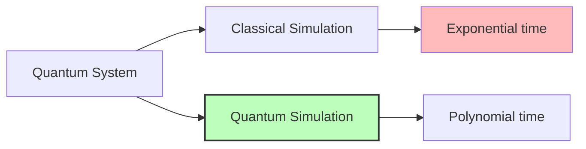

**Best Application (Even Today):**
- Simulating quantum chemistry
- Quantum mechanical systems
- Small quantum computers already useful for this

**Feynman's Focus:**
- Physicist's perspective
- Didn't care about factoring, searching, sorting
- Cared about simulating quantum systems faster

---

### 1980s: Formalization and Artificial Examples

**Developments:**

1. **Quantum Turing Machine** formally defined
   - Abstract model of quantum computation
   - Analogous to classical Turing machine
   - Mathematical foundation established

2. **First Examples of Quantum Advantage**
   - Artificial computational problems created
   - Designed specifically to show QC advantage
   - Not natural problems from computer science

**Significance:**
- Proved quantum computers can be more resource efficient
- Generated interest in the field
- **Limitation:** Problems were contrived, not practical

**Circuit Model vs Turing Machine:**

| Model | Preference | Reason |
|-------|-----------|---------|
| Quantum Turing Machine | Theoretical | Formal definitions |
| Quantum Circuits | Practical | Algorithm design |

**Note:** Similar to classical computing - circuit model more useful for designing algorithms

**Deutsch's Quantum Turing Machine (1985):**
- First formal quantum computational model
- Established theoretical foundations

---

### 1990s: The Breakthrough Decade

**Why Breakthrough?**

Natural computational problems with quantum advantage discovered!

**Impact on Computer Science:**
> "Oh my god, we have to look at quantum computers. There is no way we can ignore this thing."

**What Changed:**

These are problems:
- Studied in **first or second course** of CS
- Fundamental to computer science
- Relevant whether quantum or classical
- **Natural** problems anyone would study

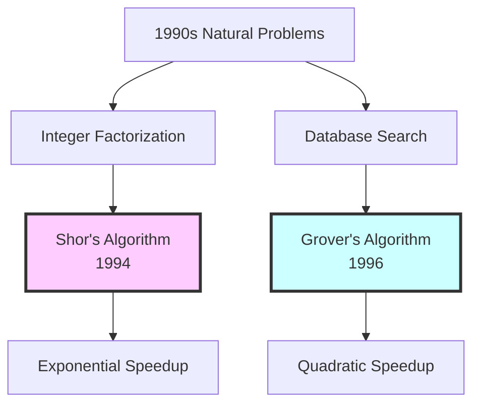

#### Shor's Algorithm (1994)

**Problem:** Integer Factorization

**Input:** Large integer $N$ (product of two primes)

**Output:** Prime factors $p$ and $q$ where $N = p \times q$

**Complexity Comparison:**

| Computer Type | Time Complexity | Example for 2048-bit number |
|---------------|-----------------|----------------------------|
| Classical (Best Known) | $\exp(n^{1/3})$ | Billions of years |
| Quantum (Shor's) | $O(n^3)$ | Hours to days |

Where $n$ is the number of bits in $N$

**Impact:**
- Threatens RSA cryptography
- Exponential speedup
- Most famous quantum algorithm

#### Grover's Algorithm (1996)

**Problem:** Unstructured Search

**Input:** Database of $N$ items, one marked item

**Output:** Find the marked item

**Complexity Comparison:**

$$\begin{align}
T_{\text{classical}} &= O(N) \\
T_{\text{quantum}} &= O(\sqrt{N})
\end{align}$$

**Speedup Type:** Quadratic (polynomial, not exponential)

**Example:** 
- $N = 1,000,000$ items
- Classical: ~1,000,000 queries
- Quantum: ~1,000 queries

---

### 2000s: Generalization and Extensions

**Progress:**

1. **Generalizing Core Ideas**
   - Extended Shor's algorithm techniques to broader problems
   - Extended Grover's algorithm applications
   
2. **Building Blocks for New Algorithms**
   - Most quantum algorithms use Shor's or Grover's ideas
   - Quantum Machine Learning algorithms built on these foundations

**Major Addition: HHL Algorithm**

**HHL = Harrow-Hassidim-Lloyd Algorithm (2009)**

**Problem:** Solving Systems of Linear Equations

**Input:** Matrix $A$ and vector $\vec{b}$

**Output:** Solution $\vec{x}$ where $A\vec{x} = \vec{b}$

**For $n \times n$ matrix:**

| Method | Complexity |
|--------|-----------|
| Classical | $O(n^2)$ to $O(n^{2.37})$ |
| Quantum (HHL) | $O(\log n)$ (with caveats) |

**Applications:**
- Machine learning
- Optimization
- Data analysis

**Note:** Uses Grover's algorithm as subroutine

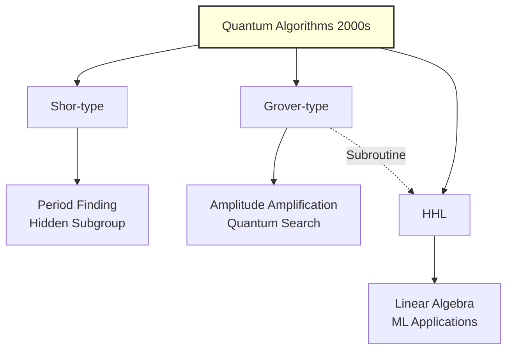

---

### 2010s-Present: Hardware and Practical Development

**Hardware Breakthroughs:**

**Progress Timeline:**

| Year | Qubits | Notes |
|------|--------|-------|
| ~2010 | 3-5 qubits | Early demonstrations |
| ~2015 | ~50 qubits | First "quantum supremacy" scale |
| ~2020 | ~100 qubits | Various architectures |
| 2023+ | 1000+ qubits | With restrictions |

**Important Caveat:**
- 1000 qubit ≠ better than 100 qubit automatically
- Depends on:
  - **Connectivity** (which qubits can interact)
  - **Gate fidelity** (error rates)
  - **Coherence time** (how long states persist)
  - **Allowed operations** (full universal vs. limited)

**Various Forms of Quantum Advantage Demonstrated:**
- Specific optimization problems
- Sampling tasks
- Simulation of quantum systems

---

## Course Coverage Plan

### Before Midterm

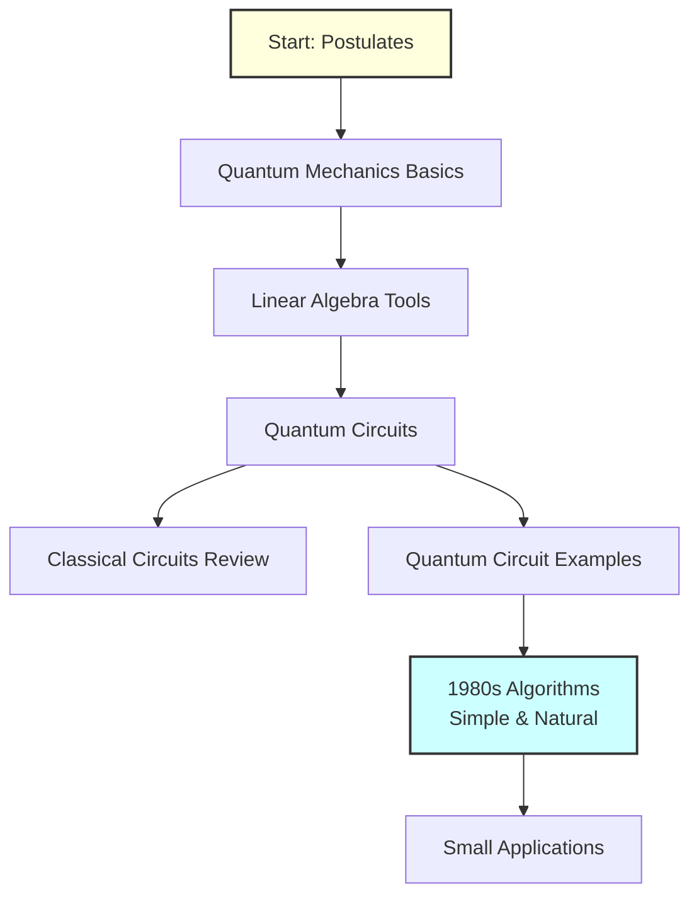

#### 1. Postulates of Quantum Mechanics

**What we'll learn:**
- Not full quantum mechanics
- Just essential postulates
- Linear algebra needed for:
  - **Input** representation (quantum states)
  - **Gates** (quantum operations)
  - **Output** (measurement)

**Mathematical Framework:**

Quantum states as vectors:
$$|\psi\rangle \in \mathbb{C}^{2^n}$$

Quantum gates as matrices:
$$U: \mathbb{C}^{2^n} \to \mathbb{C}^{2^n}, \quad U^\dagger U = I$$

Measurements as projections

**Assumption:** Students know linear algebra basics

#### 2. Quantum Circuits

**Components:**
- Classical circuits (brief review)
- Quantum gates
- Circuit composition
- Many examples

**Goal:** Build intuition through examples

#### 3. 1980s Algorithms

**Approach:** Discovery-based learning
- Natural, simple problems
- Students should be able to derive algorithms themselves
- Foundation for understanding more complex algorithms

---

### After Midterm

```mermaid
flowchart TD
    A[Major Algorithms] --> B[Shor-type Algorithms]
    A --> C[Grover-type Algorithms]
    
    B --> D[Period Finding<br/>Factoring]
    C --> E[Search<br/>Amplitude Amplification]
    
    F[Quantum Advantage Theory] --> G[Lower Bounds]
    F --> H[Complexity Classes]
    
    G --> I[Grover is Optimal<br/>for Search]
    H --> J[Problems with<br/>Exponential Advantage]
    
    style B fill:#fcf,stroke:#333,stroke-width:2px
    style C fill:#cff,stroke:#333,stroke-width:2px
    style F fill:#ffd,stroke:#333,stroke-width:3px
```

#### 1. Shor-type Algorithms

**Topics:**
- Period finding
- Quantum Fourier Transform
- Integer factorization
- Discrete logarithm

#### 2. Grover-type Algorithms

**Topics:**
- Quantum search
- Amplitude amplification
- Applications to optimization

#### 3. Quantum Advantage Analysis (New!)

**Unique Feature:** Not covered in most QC courses

**Questions Addressed:**

1. **Optimality:** Is Grover's algorithm the best possible for search?
   - **Answer:** YES! (Will prove)
   
2. **Scaling:** Can we do better with larger problems?
   - **Answer:** Slightly better, but not exponentially
   
3. **Classification:** Which problems admit exponential quantum advantage?

**Techniques:**

```mermaid
graph LR
    A[Proving Quantum Advantage] --> B[Upper Bounds<br/>Quantum Algorithms]
    A --> C[Lower Bounds<br/>Classical Impossibility]
    
    B --> D[Show QC solves<br/>problem fast]
    C --> E[Prove CC cannot<br/>solve fast]
    
    style A fill:#bfb,stroke:#333,stroke-width:3px
```

**Lower Bound Techniques:**
- Query complexity
- Communication complexity
- Adversary methods

**Outcome:** Identify class of problems with **provable exponential quantum advantage**

---

## Quantum Hardware: Can We Build It?

### Current Belief

**Question to Class:** Can we build a full-fledged quantum computer?

**Answer:** Yes, likely in our lifetime

**Evidence:**
1. Rapid recent progress
2. Scaling from 3 qubits → 1000+ qubits
3. Continued improvements in stability and control

---

### Two Fundamental Challenges

#### Challenge 1: Stability (Coherence)

**Problem:** Quantum states are fragile

```mermaid
graph LR
    A[Prepare Quantum State] --> B[Apply Operations]
    B --> C[More Operations]
    C --> D[Measure Output]
    
    E[Decoherence] -.->|Destroys state| B
    E -.->|Destroys state| C
    
    style E fill:#fbb,stroke:#333,stroke-width:2px
```

**Issue:**
- States change **before** computation finishes
- Environmental noise causes errors
- Must complete computation within **coherence time**

**Mathematical Constraint:**
$$T_{\text{computation}} < T_{\text{coherence}}$$

**Example:**
- 10 qubits prepared
- Start applying operations
- Before finishing, states have decohered
- Computation invalid

**Solutions Being Pursued:**
- Better isolation (cryogenic temperatures)
- Error correction codes
- Faster gates
- Topological qubits (more stable)

---

#### Challenge 2: Scalability

**Problem:** Can't simply combine quantum computers

**Classical Approach:**
$$\text{Want more power?} \implies \text{Add more chips}$$

**Quantum Reality:**
$$50 \text{ qubits} + 50 \text{ qubits} \neq 100 \text{ qubit system}$$

```mermaid
graph TB
    A[Classical Scaling] --> B[Chip 1: 50 bits]
    A --> C[Chip 2: 50 bits]
    B --> D[Total: 100 bits ✓]
    C --> D
    
    E[Quantum Scaling] --> F[System 1: 50 qubits]
    E --> G[System 2: 50 qubits]
    F -.->|Cannot simply combine| H[Need entanglement<br/>across systems]
    G -.->|Cannot simply combine| H
    
    style H fill:#fbb,stroke:#333,stroke-width:2px
    style D fill:#bfb,stroke:#333,stroke-width:2px
```

**Why Different?**

**Entanglement** requires:
- Direct quantum interactions between qubits
- Cannot be "connected" like classical wires
- State space grows as $2^n$, not $n$

**State Space Comparison:**

| System | State Space Dimension |
|--------|----------------------|
| 50 qubits | $2^{50} \approx 10^{15}$ |
| 50 qubits + 50 qubits (separate) | $2^{50} + 2^{50} \approx 2 \times 10^{15}$ |
| 100 qubits (unified) | $2^{100} \approx 10^{30}$ |

**The Gap:**
$$2 \times 2^{50} \ll 2^{100}$$

Going from 50 → 100 qubits requires building an entirely new, larger quantum system with entanglement capabilities.

---

### Understanding Qubit Counts

**Common Misconception:**
> "1000 qubit computer > 100 qubit computer"

**Reality:** Quality matters more than quantity

**Factors to Consider:**

| Factor | Description | Impact |
|--------|-------------|--------|
| **Connectivity** | Which qubits can interact | Limited connectivity → need SWAP operations |
| **Gate Fidelity** | Error rate per operation | High errors → short useful depth |
| **Coherence Time** | How long states persist | Short time → limited computation |
| **Operation Set** | Full universal vs restricted | Restricted → limited algorithms |

**Examples:**

**System A:** 1000 qubits
- Nearest-neighbor connectivity only
- Local operations allowed
- Short coherence time

**System B:** 100 qubits
- Full connectivity
- Universal gate set
- Long coherence time

**System B might be more useful for many algorithms!**

---

### Current State and Future Outlook

**Progress Being Made:**

1. **Stability Improvements**
   - Longer coherence times
   - Better error correction
   - Improved isolation techniques

2. **Scalability Advances**
   - Better qubit fabrication
   - Improved control electronics
   - New architectures (topological, photonic)

**Timeline Prediction:**

> Full-fledged quantum computer in our lifetime
> - Likely not on every desk
> - But in every (major) department
> - Accessible for research and industry

**Different Approaches:**

```mermaid
graph TD
    A[Quantum Hardware Platforms] --> B[Superconducting Qubits<br/>Google, IBM]
    A --> C[Trapped Ions<br/>IonQ, Honeywell]
    A --> D[Photonic<br/>Xanadu, PsiQuantum]
    A --> E[Neutral Atoms<br/>QuEra]
    A --> F[Topological<br/>Microsoft]
    
    B --> G[Fast gates<br/>scalability challenges]
    C --> H[High fidelity<br/>slower gates]
    D --> I[Room temperature<br/>connectivity challenges]
    
    style A fill:#ffd,stroke:#333,stroke-width:2px
```

Each platform has trade-offs in addressing stability and scalability.

---

## Summary: Key Takeaways

### Computational Power

1. **Weak Church-Turing NOT Broken**
   - QC and CC can simulate each other
   - No problems computable by one but not the other

2. **Strong Church-Turing CHALLENGED**
   - QC can be exponentially more efficient
   - Resource efficiency is the quantum advantage

### Historical Development

| Era | Milestone |
|-----|-----------|
| 1970s-80s | Feynman's insight, formalization, artificial examples |
| 1990s | **Breakthrough:** Shor's and Grover's algorithms |
| 2000s | Generalization, HHL algorithm |
| 2010s-Present | Hardware development, demonstrated advantages |

### Course Structure

**Before Midterm:**
- Quantum mechanics postulates
- Linear algebra tools
- Quantum circuits
- 1980s algorithms

**After Midterm:**
- Shor-type algorithms
- Grover-type algorithms
- **Quantum advantage theory** (unique!)
- Lower bounds and optimality

### Hardware Reality

**Challenges:**
- **Stability:** Coherence vs decoherence
- **Scalability:** Entanglement requirements

**Outlook:** Optimistic for full-fledged quantum computers in our lifetime

---

## Mathematical Summary

### Complexity Relationships

**Classical simulating Quantum:**
$$T_{\text{QC}} = T \implies T_{\text{CC}} = \Omega(f(T))$$
where $f(T)$ could be exponential

**Quantum simulating Classical:**
$$T_{\text{CC}} = T \implies T_{\text{QC}} = O(cT)$$
where $c$ is a small constant

### Speedup Examples

**Shor's Algorithm:**
$$\frac{T_{\text{classical}}}{T_{\text{quantum}}} = \frac{\exp(n^{1/3})}{n^3} = \text{exponential}$$

**Grover's Algorithm:**
$$\frac{T_{\text{classical}}}{T_{\text{quantum}}} = \frac{N}{\sqrt{N}} = \sqrt{N} = \text{quadratic}$$

**State Space for Simulation:**
$$n \text{ particles} \implies 2^n \text{ dimensional Hilbert space}$$

This exponential scaling is why quantum simulation is hard classically but natural on quantum hardware.
