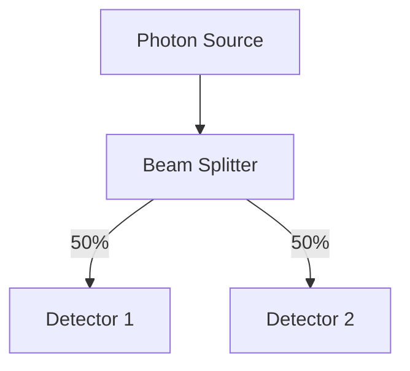
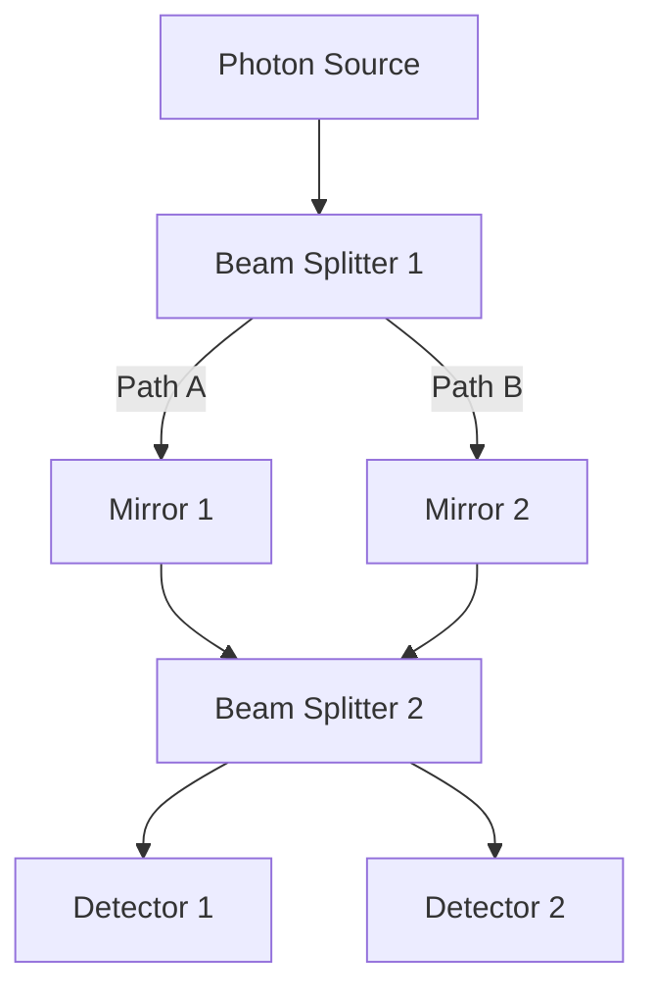
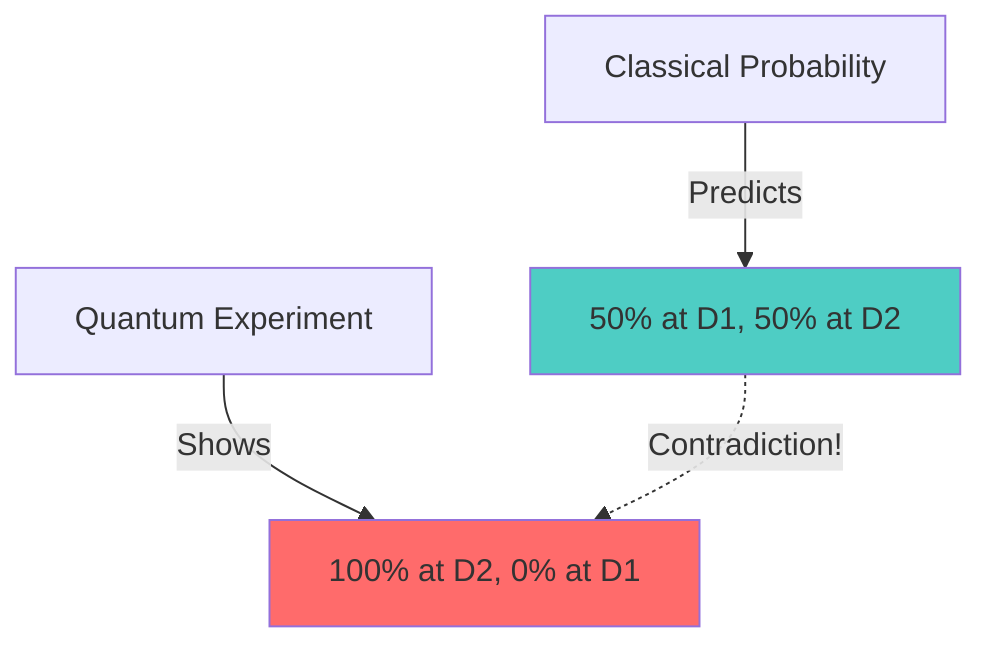

# Quantum Computing - Lecture 2: Understanding Quantum Weirdness

## Overview

This lecture focuses on demonstrating why quantum mechanics is fundamentally different from classical (including probabilistic) computation through experimental evidence, particularly the Mach-Zehnder Interferometer.

---

## 1. What is Quantum Computing?

### Core Concept
- **Computation** = Encoding computational processes in physical laws
- **Quantum Computation** = Using quantum systems that obey quantum mechanical laws to compute

### Why Quantum Computing?

1. **Universality**: Quantum mechanics is a theory of almost everything
2. **Resource Efficiency**: Quantum laws are counterintuitive compared to classical laws
   - Different laws → Different computational capabilities
   - Potential for solving problems more efficiently

### Key Insight
> If we start with fundamentally different physical laws, we can potentially compute things differently than classical systems.

---

## 2. Probabilistic (Randomized) Computation

Before understanding quantum weirdness, we must understand classical randomness.

### 2.1 Deterministic vs. Probabilistic Algorithms

#### Deterministic Computation

```mermaid
graph LR
    A[Input X] --> B[Algorithm A]
    B --> C[Output A(X)]
    C --> D[Always Same Output for Same Input]
```

**Characteristics:**
- Fixed input → Fixed output
- Output depends only on input
- Examples: Binary search, Quicksort, Dijkstra's algorithm

**Limitation**: Too strict for many useful problems; often too expensive (time-consuming)

#### Probabilistic Computation

```mermaid
graph LR
    A[Input X] --> B[Algorithm A]
    E[Random String R] --> B
    B --> C[Output A(X,R)]
    C --> D[Output depends on X and R]
```

**Characteristics:**
- Algorithm uses coin tosses (randomness)
- Steps depend on both input AND random choices
- Output A(X,R) is a **random variable**

---

### 2.2 Correctness Definitions for Randomized Algorithms

When we allow randomness, we need new definitions of "correct":

| Correctness Type | Definition | Usefulness |
|-----------------|------------|------------|
| **All R's** | Works for every random string | Same as deterministic - no advantage! |
| **Most R's** | Works for majority of random strings | **USEFUL** - This is what we want! |
| **At least one R** | Works for at least one random string | Not practical - too unreliable |

#### The Right Choice: "Most R's"

For a randomized algorithm to be useful:
- Should work for a **significant fraction** of random strings (e.g., ≥ 2/3)
- For ALL inputs X, algorithm works for most random choices R
- Not: works for most inputs (that would be useless!)

---

### 2.3 Two Approaches to Correctness

#### Approach 1: Probabilistic Correctness
- Algorithm works for most random strings R
- Running time = worst-case over all X and R

#### Approach 2: Expected Time
- Algorithm always produces correct answer
- Time cost measured in **expectation** (average over random choices)

---

### 2.4 Example: Estimating π

**Problem**: Approximate the value of π

#### Monte Carlo Method (Randomized Algorithm)

**Setup:**
- Draw a square with side length 1
- Draw a circle inside with radius 1/2
- Circle area = π × (1/2)² = π/4
- Square area = 1 × 1 = 1

**Algorithm:**
1. Randomly throw darts (pick random points (x,y) where 0 ≤ x,y ≤ 1)
2. Check if point is inside circle: x² + y² ≤ (1/2)²
3. Count points inside circle vs. total points

**Mathematical Foundation:**

$$\frac{\text{Points in Circle}}{\text{Points in Square}} \approx \frac{\text{Area of Circle}}{\text{Area of Square}} = \frac{\pi/4}{1} = \frac{\pi}{4}$$

Therefore:

$$\pi \approx 4 \times \frac{\text{Points in Circle}}{\text{Total Points}}$$

**Analysis Tools Needed:**
- Chernoff Bound
- Law of Large Numbers
- Concentration Inequalities

These prove that with high probability, this estimate converges to π.

---

## 3. The Mach-Zehnder Interferometer

Now we examine quantum behavior to show it's NOT just probabilistic computation.

### 3.1 Simple Beam Splitter (Classical-Like Behavior)

#### Setup



**Beam Splitter Properties:**
- Splits incoming light beam
- 50% passes through (transmitted)
- 50% reflected

**Observation:**
- Even with single photons, 50% detected at D1, 50% at D2
- Appears like coin toss: Heads → pass through, Tails → reflect

**Classical Interpretation:** ✓ Can be explained by probabilistic computation!

---

### 3.2 Full Mach-Zehnder Interferometer (Quantum Weirdness!)

#### Setup



**Components:**
- Two beam splitters
- Two mirrors (always reflect - redirect light back to second beam splitter)
- Two detectors

---

### 3.3 Classical Probabilistic Prediction

Let's calculate using classical probability:

**Step 1: First Beam Splitter**
- Probability photon takes Path A = 1/2
- Probability photon takes Path B = 1/2

**Step 2: Mirrors**
- Both paths redirected to second beam splitter

**Step 3: Second Beam Splitter**

For Path A arriving at BS2:
- Probability → D1 = 1/2
- Probability → D2 = 1/2

For Path B arriving at BS2:
- Probability → D1 = 1/2  
- Probability → D2 = 1/2

**Final Classical Prediction:**

$$P(D1) = P(\text{Path A}) \times P(\text{A→D1}) + P(\text{Path B}) \times P(\text{B→D1})$$

$$P(D1) = \frac{1}{2} \times \frac{1}{2} + \frac{1}{2} \times \frac{1}{2} = \frac{1}{4} + \frac{1}{4} = \frac{1}{2}$$

Similarly:

$$P(D2) = \frac{1}{2}$$

**Classical Prediction:** 50% at D1, 50% at D2

---

### 3.4 Actual Experimental Result

**What Actually Happens:**
- **100% of photons detected at D2**
- **0% of photons detected at D1**

(Or vice versa depending on exact setup - one detector gets ALL photons, other gets NONE)

---

### 3.5 Why This is Shocking



**Key Points:**

1. **Cannot be explained by randomness**: 
   - Simple beam splitter looked random (could be explained probabilistically)
   - Full interferometer violates probabilistic predictions

2. **Interference phenomenon**:
   - The two paths somehow "interfere" with each other
   - This is NOT classical probability

3. **Implication**:
   - Quantum mechanics operates on fundamentally different principles
   - Not just "enhanced randomness"
   - Something genuinely new is happening

---

## 4. Key Takeaways

### Comparison Table

| Aspect | Classical Deterministic | Classical Probabilistic | Quantum |
|--------|------------------------|------------------------|---------|
| Randomness | No | Yes (coin tosses) | Yes (but different!) |
| Simple beam splitter | N/A | Can explain ✓ | Can explain ✓ |
| Mach-Zehnder | N/A | **Cannot explain** ✗ | Can explain ✓ |
| Nature | Predictable | Random | Counterintuitive |

### Why Study Quantum Computing?

1. **Quantum mechanics is weird** - demonstrated by Mach-Zehnder
2. **Not just probabilistic** - violates classical probability predictions
3. **Potential for new algorithms** - different physics → different computational power
4. **Experimentally verified** - these are real, repeatable experiments

---

## 5. Important Concepts to Review

### For Probabilistic Computing:
- Random variables
- Expected value
- Chernoff bounds
- Law of large numbers
- Concentration inequalities

### Resources:
- Randomized algorithms textbooks
- Probability theory
- Quantum mechanics experiments
- Anthropic's documentation on quantum systems

---

## 6. Looking Ahead

**Next Steps:**
- Understanding WHY the Mach-Zehnder works this way (quantum mechanical principles)
- Translating these physical phenomena into quantum algorithms
- Using interference effects for computational advantage

**Course Goal:**
> Convince you that quantum mechanics is sufficiently weird and different from classical computation that it deserves 3-4 months of study, and can potentially lead to more efficient algorithms.

---

## Mathematical Notes

### Probability Calculation (Classical Prediction)

Given equal path lengths in Mach-Zehnder:

$$\text{At BS1: } |\psi\rangle \rightarrow \frac{1}{\sqrt{2}}|A\rangle + \frac{1}{\sqrt{2}}|B\rangle$$

$$\text{Classical: } P(D1) = \left(\frac{1}{\sqrt{2}}\right)^2 \times \frac{1}{2} + \left(\frac{1}{\sqrt{2}}\right)^2 \times \frac{1}{2} = \frac{1}{2}$$

But this is wrong! Quantum mechanics requires **amplitude** addition, not probability addition.

---

## Summary

This lecture establishes that:
1. Probabilistic computation extends deterministic computation by allowing randomness
2. Simple quantum phenomena (single beam splitter) can mimic probabilistic behavior
3. Complex quantum phenomena (Mach-Zehnder) **cannot** be explained by classical probability
4. This fundamental difference motivates the study of quantum computing
5. These experimental results are real and have been verified

The weirdness of quantum mechanics isn't just theoretical - it's measurable, repeatable, and forms the foundation for quantum algorithms we'll develop later.
