# Quantum Computing: Mach-Zehnder Interferometer and Wave-Particle Duality

## Introduction to Quantum Weirdness

This lecture introduces fundamental quantum mechanical phenomena that defy classical intuition, specifically focusing on the **Mach-Zehnder Interferometer** and its implications for quantum computing.

### Key Philosophical Point
Classical probability theory cannot explain quantum phenomena. We need **negative probabilities** or a completely new mathematical framework to understand quantum mechanics.

---

## The Mach-Zehnder Interferometer

### Basic Setup

The Mach-Zehnder interferometer is an optical device consisting of:
- **Beam splitters** (50-50 mirrors)
- **Mirrors**
- **Two detectors** (D1 and D2)


### Normal Operation (Both Paths Open)

When a photon enters the interferometer with both paths available:

**Classical Expectation:**
- 50% probability at D1
- 50% probability at D2

**Quantum Reality:**
- **0% at D1** (no photons detected!)
- **100% at D2** (all photons detected!)

This happens due to **destructive interference** at D1 and **constructive interference** at D2.

---

## The Paradox: Blocking One Path

### Blocking Path 2 (Adding Concrete Slab)

When we physically block one path with a concrete slab:

```mermaid
graph LR
    A[Photon Source] --> B[Beam Splitter 1]
    B -->|50%| C[Mirror 1]
    B -->|50%| D[Mirror 2 - BLOCKED ❌]
    C --> E[Beam Splitter 2]
    E -->|25%| F[Detector D1]
    E -->|25%| G[Detector D2]
```



**Results:**
- **25% at D1** (now we see photons!)
- **25% at D2**
- 50% lost (absorbed by concrete)

### Why This Is Weird

| Scenario | Paths Available | D1 Detection | D2 Detection |
|----------|----------------|--------------|--------------|
| Both paths open | 2 | 0% | 100% |
| One path blocked | 1 | 25% | 25% |

**The Paradox:** By blocking a path (reducing options), we **increase** the probability of detection at D1 from 0% to 25%!

**Classical Logic Says:** More paths → Higher probability
**Quantum Reality:** More paths → Interference → Can lead to ZERO probability!

---

## Understanding Interference

### Constructive vs Destructive Interference

**Constructive Interference** (waves align):
- Crest + Crest = Larger amplitude
- Trough + Trough = Larger amplitude (negative)
- Result: **Increased probability**

**Destructive Interference** (waves cancel):
- Crest + Trough = Cancel out
- Result: **Zero probability**

### Wave Representation

At **Detector D2** (constructive):
```
Wave from Path 1:  ∿∿∿∿
Wave from Path 2:  ∿∿∿∿
Combined:          ≈≈≈≈ (amplified)
```

At **Detector D1** (destructive):
```
Wave from Path 1:  ∿∿∿∿
Wave from Path 2:  ∽∽∽∽ (phase shifted)
Combined:          ____ (cancelled)
```

### Phase Difference

The key to interference is **phase difference**:
- When light reflects off the back mirror in the interferometer, it gains an additional phase
- This phase difference causes one path to be "shifted" relative to the other
- At D1: π phase difference → destructive interference
- At D2: 0 phase difference → constructive interference

---

## Wave-Particle Duality

### Single Photon Experiments

Even when shooting **one photon at a time** using a photon gun:
- Same interference pattern emerges
- 0% at D1, 100% at D2 (both paths open)
- 25% at each detector (one path blocked)

### Critical Implication

A **single photon** exhibits wave-like interference:
- Cannot say the photon went through Path 1 OR Path 2
- Must say the photon went through BOTH paths simultaneously
- This is **superposition**

**Classical Thinking:** Photon is here OR there
**Quantum Reality:** Photon is in **superposition** of both locations

---

## Representation in Quantum Computing

### Photon as a Qubit

The photon's state can encode quantum information:

- **State |0⟩**: Photon at detector position 0
- **State |1⟩**: Photon at detector position 1
- **Superposition**: $|\psi\rangle = \alpha|0\rangle + \beta|1\rangle$

Where:
- $\alpha, \beta$ are complex probability amplitudes
- $|\alpha|^2 + |\beta|^2 = 1$ (normalization)
- Can have $\alpha < 0$ or complex values (explains cancellation!)

### Why Classical Probability Fails

Classical probabilities $P_1, P_2$:
- Always: $P_1, P_2 \geq 0$
- Total: $P_1 + P_2 = 1$
- Cannot explain: $P_1 + P_2 = 0$ (what we observe at D1)

Quantum amplitudes $\alpha, \beta$:
- Can be negative or complex
- Probabilities: $P_1 = |\alpha|^2$, $P_2 = |\beta|^2$
- **Amplitudes can cancel**: $\alpha + \beta = 0$, even if $\alpha, \beta \neq 0$

---

## Elitzur-Vaidman Bomb Testing Problem

### Problem Setup

A factory produces bombs with two types:
1. **Dud bombs**: Photon passes through (like nothing there)
2. **Real bombs**: Absorb photon and **explode**

**Challenge:** Determine if a bomb is real **without exploding it**

### Classical Approach

Classical testing:
- Shoot photon at bomb
- If dud → photon passes
- If real → **bomb explodes** (destroyed!)
- **Impossible to verify real bomb without destroying it**

### Quantum Solution Using Mach-Zehnder

Place the bomb in position of Mirror 2:

```mermaid
graph LR
    A[Photon] --> B[BS1]
    B --> C[Mirror 1]
    B --> D[💣 Bomb]
    C --> E[BS2]
    D -.->|If real: absorbs| E
    E --> F[D1]
    E --> G[D2]
```



### Case 1: Bomb is Dud

If bomb is dud (doesn't interact):
- **Identical to normal interferometer**
- 0% at D1
- 100% at D2
- **Conclusion**: If we see photon only at D2 → Could be dud (or real)

### Case 2: Bomb is Real

If bomb is real (absorbs photon):
- Acts like "concrete slab" blocking path
- Three outcomes possible:

| Outcome | Probability | Interpretation | Bomb Status |
|---------|-------------|----------------|-------------|
| Bomb explodes | 50% | Photon absorbed | Real (but destroyed) |
| Detect at D1 | 25% | **Photon not absorbed** | **Real AND intact!** ✓ |
| Detect at D2 | 25% | Photon not absorbed | Ambiguous (could be dud) |

### The Magic Result

**If we detect photon at D1:**
- This is **impossible** if bomb were dud (0% probability)
- Therefore bomb **must be real**
- But photon wasn't absorbed (conservation of energy)
- So bomb **hasn't exploded**!

**Success Rate:** 25% of the time we can verify bomb is real without exploding it!

### Probability Breakdown

For real bomb:
```
Total photons sent: 100

50 photons → Bomb explodes (absorbed)
25 photons → Detected at D1 (REAL, NOT EXPLODED) ✓
25 photons → Detected at D2 (inconclusive)
```

**Success rate**: 25/100 = 25% certain identification without explosion

### Why This Works

1. **Bomb acts as measurement device** when real
2. If photon goes toward bomb (Path 2) → 50% absorbed
3. If photon goes through Path 1 → Can reach D1 (normally impossible)
4. Detection at D1 proves bomb blocked Path 2
5. No absorption at D1 → bomb intact

**Key Insight:** The bomb's presence creates interference pattern change without direct interaction!

---

## Improving the Bomb Test

### Advanced Technique (Mentioned)

Using quantum gates and repeated measurements:
- Can increase success probability close to 100%
- Uses quantum Zeno effect
- Requires more complex gate operations
- Will be covered later in course

---

## Fundamental Quantum Mechanics Principles

### Superposition

**Definition:** A quantum system can exist in multiple states simultaneously until measured.

**Mathematical Form:**
$$|\psi\rangle = \alpha|0\rangle + \beta|1\rangle$$

Where:
- $|\psi\rangle$ is the quantum state
- $|0\rangle, |1\rangle$ are basis states
- $\alpha, \beta$ are complex amplitudes
- Constraint: $|\alpha|^2 + |\beta|^2 = 1$

**Not the same as:**
- Classical probability mixture
- Being in one state OR another
- Being in both states simultaneously (classical sense)

**Better description:** A fundamentally new quantum property

### Measurement

When we measure a quantum system in superposition:

**Before Measurement:**
$$|\psi\rangle = \alpha|0\rangle + \beta|1\rangle$$

**After Measurement:**
- Collapse to $|0\rangle$ with probability $|\alpha|^2$
- OR collapse to $|1\rangle$ with probability $|\beta|^2$
- Superposition is **destroyed**

### Why Classical Intuition Fails

**Classical mind assumes:** System is in one definite state, we just don't know which
**Quantum reality:** System is genuinely in superposition until measured

**Example of failure:**
- If photon were definitely in Path 1 OR Path 2
- No interference would occur
- We would see 50-50 split at detectors
- But we observe 0-100 split → Must be in superposition

---

## Implications for Quantum Computing

### Quantum vs Classical Bits

**Classical Bit:**
- State: 0 OR 1
- Operations: Logical gates (AND, OR, NOT)
- Parallel processing: Multiple bits needed

**Quantum Qubit:**
- State: $\alpha|0\rangle + \beta|1\rangle$ (superposition)
- Operations: Quantum gates (unitary matrices)
- Parallel processing: One qubit explores multiple paths

### Computational Advantage Sources

1. **Superposition:** Process multiple inputs simultaneously
2. **Interference:** Cancel wrong answers, amplify correct ones
3. **Entanglement:** Correlate multiple qubits non-classically (discussed later)

### Not Just Parallelism

**Common Misconception:** Quantum computer = massively parallel classical computer

**Reality:**
- Classical parallel: Each processor explores one path
- Quantum: One processor explores all paths, but must carefully manage interference
- Cannot simply "read out all answers" - measurement collapses superposition

**Key Difference:** Algorithm design must ensure:
- Correct answers have **constructive interference**
- Wrong answers have **destructive interference**

---

## Quantum Circuits

### Basic Structure

Every quantum algorithm can be represented as a circuit:

```mermaid
graph LR
    A[Input State |ψ⟩] --> B[Gate 1]
    B --> C[Gate 2]
    C --> D[Gate 3]
    D --> E[Measurement]
    E --> F[Classical Output]
```

**Components:**
1. **Input:** Initial quantum state $|\psi_{\text{in}}\rangle$
2. **Gates:** Unitary operations (reversible transformations)
3. **Measurement:** Collapse superposition → classical output

### Example: Mach-Zehnder as Circuit

```
|0⟩ ───[BS1]───[Phase]───[BS2]───[Measure]
```

Where:
- BS1, BS2 = Beam splitter operations
- Phase = Phase shift from path difference

### What We Need to Learn

To design quantum algorithms, we must understand:

1. **Quantum States:** How to represent $|\psi\rangle$ mathematically
2. **Quantum Gates:** What operations are allowed, how they transform states
3. **Composite Systems:** How to describe multiple qubits together
4. **Measurement:** How to extract classical information
5. **Entanglement:** Correlations between qubits that have no classical analog

---

## Course Preview

### Mathematical Framework Needed

**Linear Algebra:**
- Vector spaces (for quantum states)
- Complex numbers (for amplitudes)
- Unitary matrices (for gates)
- Tensor products (for composite systems)

**Quantum Postulates:**
1. State space representation
2. Evolution (Schrödinger equation)
3. Measurement (Born rule)
4. Composite systems (tensor products)

### Topics to Cover

1. **Week 1-4:** Quantum mechanics formalism
   - States, gates, measurements
   - Single qubit operations
   - Multi-qubit systems
   
2. **Week 5-8:** Quantum algorithms
   - Deutsch's algorithm (1986) - derived from interferometer!
   - Grover's search
   - Quantum Fourier transform
   
3. **Week 9-12:** Advanced topics
   - Shor's factoring algorithm
   - Quantum error correction
   - Entanglement applications

---

## Key Takeaways

### Conceptual Understanding

1. **Quantum mechanics is fundamentally different from classical physics**
   - Not just smaller or faster
   - Requires entirely new mathematical framework
   
2. **Superposition is not uncertainty**
   - Not "we don't know which state"
   - Genuinely in multiple states simultaneously
   
3. **Measurement changes the system**
   - Cannot observe without disturbing
   - Superposition collapses to definite state

### Practical Implications

1. **Quantum computing is not just parallel computing**
   - Requires careful interference management
   - Algorithm design fundamentally different
   
2. **Real experiments confirm these predictions**
   - Mach-Zehnder experiments done in labs worldwide
   - Bomb testing is theoretical but based on solid principles
   
3. **New capabilities emerge**
   - Solve certain problems exponentially faster
   - Enable new types of cryptography
   - Simulate quantum systems efficiently

### Philosophical Notes

**Don't try to visualize superposition classically** - our brains evolved in classical world

**Accept the mathematics** - it accurately predicts experiments even if unintuitive

**Magic is an acceptable description** - even experts after 20+ years don't have perfect intuition

---

## Common Questions Addressed

### Q: How can one photon be in two places?

**A:** It's not in two places in the classical sense. It's in a quantum superposition - a fundamentally new state that cannot be described as "here OR there" or "here AND there".

### Q: Does the photon interact with both paths?

**A:** Asking about classical interaction misses the point. The photon's quantum state encompasses both paths. Upon measurement, it manifests at one location.

### Q: What if we try to see which path the photon takes?

**A:** Any attempt to measure the path will collapse the superposition. You'll see the photon in one path, but the interference pattern will disappear!

### Q: Is this related to probability?

**A:** The final outcomes have probabilities, but the intermediate state cannot be described by classical probability theory. We need **probability amplitudes** (complex numbers) that can interfere.

### Q: Can we use this for communication?

**A:** No - measurement outcomes are random. Cannot send information faster than light or violate causality.

---

## Experimental Reality

### Has This Been Done?

**YES!** Multiple times:

- Mach-Zehnder interferometers: Standard undergraduate lab equipment
- Single photon experiments: Done since 1970s-80s
- Bomb testing: Theoretical but based on verified principles
- Mentioned in lecture: Professor A.K. Jha (IIT Physics) demonstrated live

### Why Believe It?

1. **Repeatability:** Any properly equipped lab can verify
2. **Consistency:** Quantum mechanics predicts results accurately
3. **Technology:** GPS, transistors, lasers all rely on quantum mechanics
4. **No alternative:** No classical theory can explain observations

---

## Mathematical Preview

### Probability Amplitude Example

For the interferometer (simplified):

**Path 1 amplitude:** 
$$\alpha_1 = \frac{1}{\sqrt{2}}$$

**Path 2 amplitude:** 
$$\alpha_2 = \frac{1}{\sqrt{2}}e^{i\phi}$$

**At Detector D1:**
$$\text{Total amplitude} = \alpha_1 + \alpha_2 = \frac{1}{\sqrt{2}}(1 + e^{i\phi})$$

**Probability at D1:**
$$P_{D1} = |\alpha_1 + \alpha_2|^2$$

If $\phi = \pi$ (destructive interference):
$$P_{D1} = \left|\frac{1}{\sqrt{2}}(1 + e^{i\pi})\right|^2 = \left|\frac{1}{\sqrt{2}}(1 - 1)\right|^2 = 0$$

If $\phi = 0$ (constructive interference):
$$P_{D1} = \left|\frac{1}{\sqrt{2}}(1 + 1)\right|^2 = \left|\sqrt{2}\right|^2 = 2 \times \frac{1}{2} = 1$$

This mathematics will be developed rigorously in upcoming lectures.

---

## Motivation for the Course

**Why study quantum computing?**

1. **Intellectual curiosity:** Nature behaves fundamentally differently than intuition
2. **Practical power:** Solve problems intractable for classical computers
3. **Career relevance:** Growing field with increasing industry investment
4. **Scientific literacy:** Quantum technology will shape 21st century

**Warning:** The course will become mathematical, but the mathematics enables us to:
- Predict experimental outcomes
- Design algorithms
- Understand fundamental limits of computation

**Promise:** By midterm, you will understand quantum circuits and be able to design simple quantum algorithms!

---

## Summary Table

| Concept | Classical | Quantum |
|---------|-----------|---------|
| Basic unit | Bit (0 or 1) | Qubit ($\alpha\|0\rangle + \beta\|1\rangle$) |
| Probability | Always positive | Amplitudes can be negative/complex |
| Paths | Particle takes one path | Superposition of all paths |
| Interference | No (for particles) | Yes (constructive & destructive) |
| Measurement | No effect on system | Collapses superposition |
| Information | Local | Can be entangled (non-local) |
| Computation | Sequential or parallel | Quantum superposition + interference |

---

**Next Lecture:** Formal quantum mechanical notation, state vectors, and quantum gates
